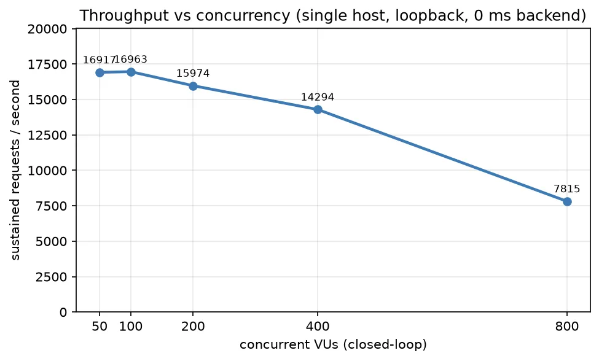
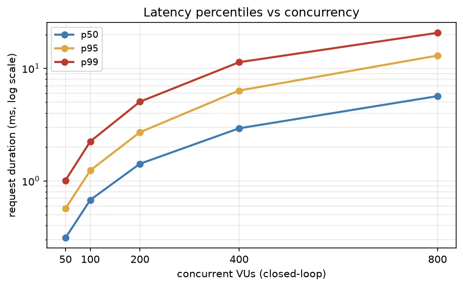
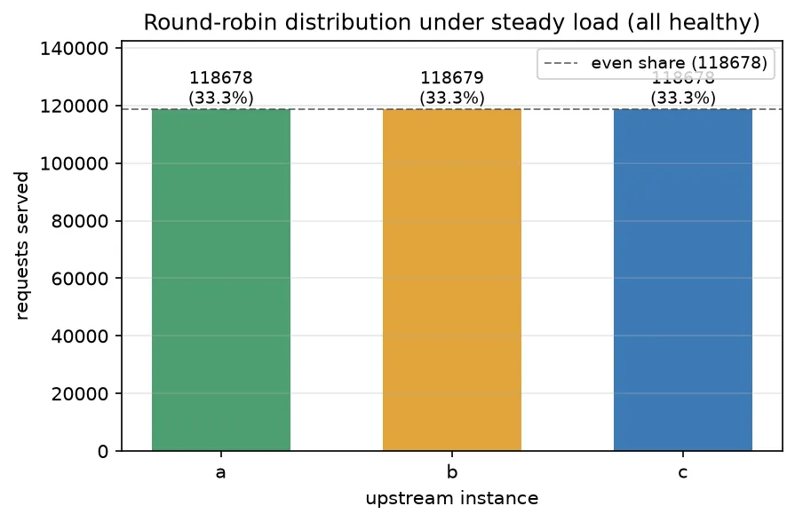
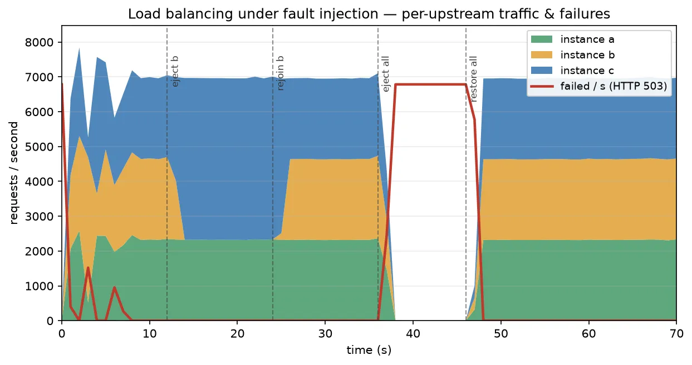
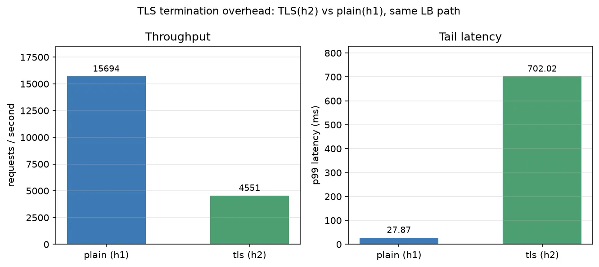
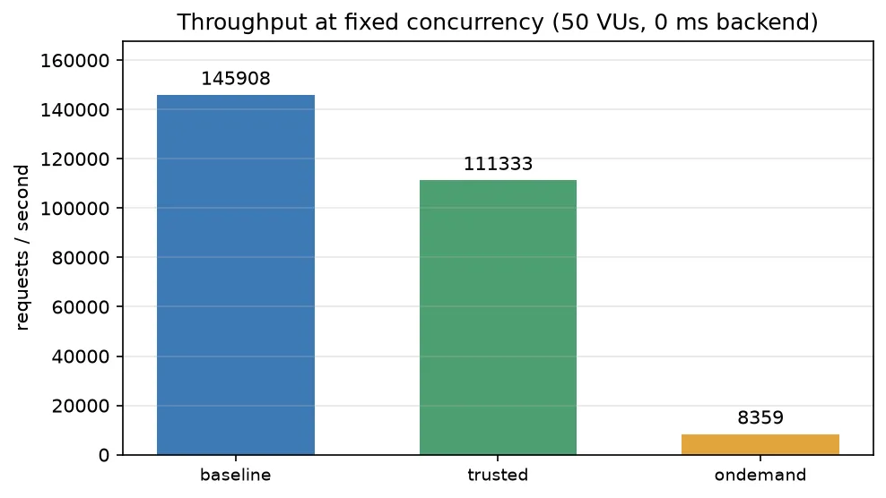
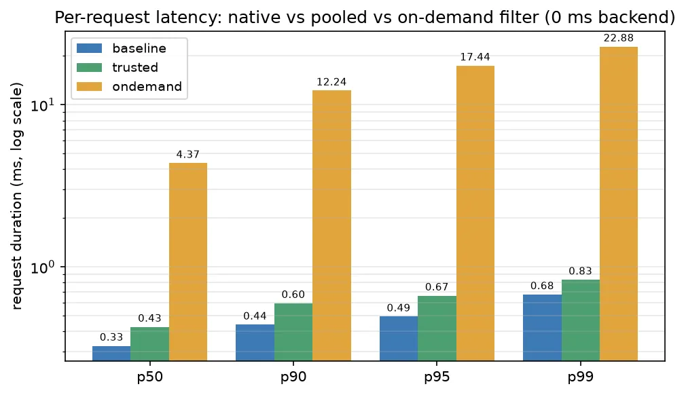
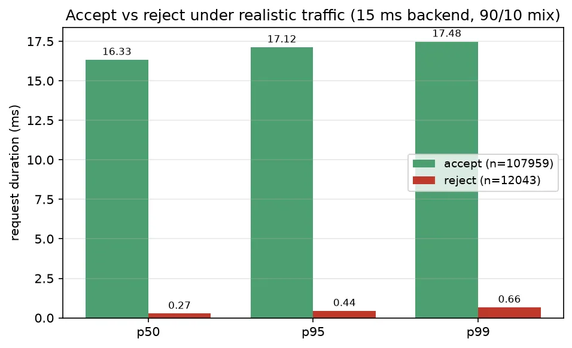

# Plecto Performance

An honest performance snapshot of Plecto's two halves: the **native load-balancing fast
path** and the **WASM extension plane** (per-request filters). The goal is **transparency
about method**, not a leaderboard. Every number here is an internal **regression baseline** —
not a capacity guide, and not a comparison against other proxies.

All components — load generator, Plecto, the upstream instances, and any tooling — run
**co-resident on a single commodity developer host over loopback**, so absolute figures are
bounded by that host's CPU, not by Plecto in isolation. Read them as **relative** signals.

## TL;DR

**Load-balancing fast path** (plaintext HTTP/1.1, 3 upstreams, trivial 0 ms backend):

- Throughput peaks at **~17k req/s** (50–100 closed-loop VUs) with **p99 ≈ 7–12 ms** and zero
  failures; it holds **~16k at 200 VUs** (p99 ≈ 27 ms) and degrades gracefully as the
  co-resident host saturates past ~400 VUs.
- An open-loop arrival rate at ~70% of peak (**~11.9k req/s**) sustains cleanly: **p50 0.69 ms,
  p99 8.4 ms, p99.9 37 ms**, 0 failures.
- Round-robin across three upstreams is **even to within one request** (33.3% each).
- **Resilience is as designed**: ejecting one upstream shifts its traffic to the survivors in
  ~1 s with **no client-visible errors**; a *total* outage **fails closed with HTTP 503** (no
  hangs) and the pool **recovers within ~1 s** of health returning.
- TLS termination (ALPN **h2**) costs real CPU under co-resident load — see the
  [honesty note](#tls-termination-h2) before reading the gap as a pure server-side cost.

**WASM extension plane** (the cost of running a decision as a sandboxed component):

- A **pooled** filter (init-once, instances reused) costs about **8% throughput** and **~1 ms
  p99** versus a no-filter native baseline — cheap on the hot path.
- The **same** filter run **fresh-per-request** drops to ~3.1k req/s vs ~14.2k pooled — a
  **~4.6× difference**. Separating `init` from per-request work is what makes the plane cheap.
- A rejected request (**HTTP 401 short-circuit**) is decided **in well under a millisecond and
  never reaches the backend** — bad traffic is shed ~30–50× faster than good traffic is forwarded.

## Scope & honesty notes

- **Machine specs intentionally omitted.** Single commodity host, loopback, everything
  co-resident. Absolute throughput is contended; treat figures as relative / regression signals.
- **Trivial upstreams** (tiny static responses, 0 ms latency by default) deliberately isolate
  **proxy + LB + filter overhead** rather than backend work. A 15 ms synthetic backend is used
  where realistic proportions matter (WASM W2).
- The LB figures are **plaintext HTTP/1.1**, except the dedicated [TLS run](#tls-termination-h2)
  which exercises rustls termination + ALPN h2.
- **No comparative claims.** Mature proxies are cited only for shared methodology, never ranking.
- Tooling: [k6](https://grafana.com/docs/k6/latest/) (open- and closed-loop executors); charts
  rendered with matplotlib → WebP; an optional InfluxDB + Grafana stack provides live dashboards.

---

# 1. Load-balancing fast path

Subject: one Plecto route forwarding to an upstream pool of **3 instances**, round-robin pick
over the healthy set, active health probe every **500 ms** with eject after **2** consecutive
failures (≈ ~1 s to detect). The scenario mirrors the project's heavy-load scenario, reduced to
a single host: the three upstream nodes become three loopback backends, so the run needs no
external network.

## Throughput & latency vs concurrency

Closed-loop sweep — a fixed number of virtual users, each issuing its next request only after
the previous response. Rising concurrency walks the load curve from comfortable to saturated.




| VUs | req/s | p50 | p95 | p99 | p99.9 | failed |
| --- | --- | --- | --- | --- | --- | --- |
| 50  | 16,917 | 2.70 ms | 5.34 ms | 7.08 ms | 9.84 ms | 0% |
| 100 | **16,963** | 5.60 ms | 10.01 ms | 12.33 ms | 15.54 ms | 0% |
| 200 | 15,974 | 11.92 ms | 22.05 ms | 27.22 ms | 35.06 ms | 0% |
| 400 | 14,294 | 26.16 ms | 52.28 ms | 66.47 ms | 86.61 ms | 0% |
| 800 | 7,815 | 48.67 ms | 107.22 ms | **1,941 ms** | 5,030 ms | 0.53% |

Throughput peaks near **100 VUs**; beyond that the closed-loop adds latency faster than work,
and at **800 VUs** the single host is overwhelmed (p99 collapses to ~2 s, first failures appear).
The useful reading is the shape: a flat-then-declining throughput ceiling with an orderly
latency climb, no cliff until genuine saturation.

## Tail latency under open-loop load

Open-loop sends at a **constant arrival rate** regardless of how fast responses come back, so
queueing surfaces in the tail instead of being hidden — the *coordinated-omission-safe* model.
At **~70% of the measured peak** the host keeps up with a clean tail:

| Model | target | achieved | p50 | p95 | p99 | p99.9 | dropped | failed |
| --- | --- | --- | --- | --- | --- | --- | --- | --- |
| open-loop, 0 ms backend | 11,873/s | 11,867 req/s | 0.69 ms | 2.51 ms | 8.40 ms | 37.23 ms | 158 | 0% |

Pushed closer to the host's ceiling the open-loop tail climbs steeply (an earlier run at ~10.9k/s
saw p99.9 ≈ 1.4 s) — that divergence *is* the saturation signal, and it is why we treat the
open-loop tail, not the optimistic closed-loop p99, as authoritative.

## Round-robin distribution



Over a steady window with all three upstreams healthy, the pool split **118,678 / 118,679 /
118,678** requests — even to a single request (33.3% each). Round-robin holds under load.

## Resilience: ejection & fail-closed

A steady open-loop rate while a controller drives a fault timeline (`eject b` → `rejoin b` →
`eject all` → `restore all`) and samples each upstream's served-count every second:



- **Even baseline.** ~6.9k req/s split three ways while healthy.
- **Graceful ejection.** When **b** is driven unhealthy its share falls to zero within ~1 s and
  the survivors (a + c) absorb the full load **with zero failed requests** — round-robin simply
  skips the ejected instance.
- **Fail-closed, not fail-open.** With **every** instance unhealthy, Plecto returns **HTTP 503**
  promptly (no hang, no blind forward); the failed/s line jumps to the full offered rate. Over
  the whole run **13.67%** of requests got a 503 — exactly those arriving with no healthy upstream.
- **Fast recovery.** Restoring health returns instances to rotation within ~1 s.

## TLS termination (h2)

The same LB path, re-run with rustls TLS termination so ALPN negotiates **HTTP/2**, against the
plaintext HTTP/1.1 path at identical concurrency (200 VUs):



| Variant | req/s | p50 | p99 | failed |
| --- | --- | --- | --- | --- |
| plain (h1) | 15,694 | 12.15 ms | 27.87 ms | 0% |
| tls (h2)   | 4,552  | 12.21 ms | 702 ms | 0% |

> **Honesty note.** This gap is *not* a clean "rustls termination is 3.4× slower" number. On a
> co-resident host the TLS handshake and per-record crypto are paid on **both** the k6 client and
> the proxy, and HTTP/2 funnels all 200 VUs over a handful of multiplexed connections — so the
> p99 inflation is largely client-side contention and h2 head-of-line, not server work alone. It
> establishes that TLS+h2 has real cost here; isolating the server's share needs a load generator
> on separate hardware (out of scope for this single-host baseline).

---

# 2. WASM extension plane

Plecto runs each request's *decision* — auth, rewriting, rate limiting, policy — as a sandboxed
**WebAssembly Component Model filter**, not native proxy code. This measures what that costs,
changing only **how the decision runs**. The bundled `examples/wasm-bench` serves three routes
that forward to the **same** backend:

| Route | Decision path |
| --- | --- |
| `/baseline/*` | no filter — native fast path only |
| `/trusted/*` | signed `filter-apikey` component, **pooled** (init-once, instances reused) |
| `/ondemand/*` | the **same** component, **fresh instance per request** |

`filter-apikey` is a real `plecto:filter` component: it reads `x-api-key`, stamps
`x-authenticated-user` on a valid key and forwards, or returns a typed `short-circuit` **401** on
a missing/invalid key (the upstream is never reached). It is cosign-signed and loaded through the
production verify-then-load path (fail-closed).

## Overhead & the value of pooling




> W1 — fixed 50 VUs, 0 ms backend, valid key. Isolates filter cost from upstream time.

| Route | req/s | p50 | p95 | p99 |
| --- | --- | --- | --- | --- |
| baseline (no filter) | 15,452 | 2.96 ms | 5.63 ms | 7.42 ms |
| pooled WASM filter | 14,238 | 3.16 ms | 6.36 ms | 8.54 ms |
| on-demand WASM filter | 3,068 | 16.05 ms | 29.95 ms | 35.03 ms |

The **pooled** filter — Plecto's default for trusted components — tracks the native baseline
closely: about **8% less throughput**, **+0.2 ms median / +1.1 ms p99**. The *same* filter run
**on-demand** (fresh, re-initialized every request) collapses to ~3.1k req/s — **~4.6× less
throughput, ~5× the latency**. That gap is the cost of `init`, paid once when pooled and on every
request when not.

## Short-circuit: rejecting bad traffic at the edge



> W2 — fixed 2000 req/s, 15 ms backend, ~90% valid / ~10% bad keys. 71,990 accepted, 8,010 rejected.

| Path | p50 | p95 | p99 |
| --- | --- | --- | --- |
| accept (200, forwarded) | 16.50 ms | 17.36 ms | 17.80 ms |
| reject (401, short-circuited) | 0.31 ms | 0.50 ms | 0.76 ms |

Accepted requests cost the 15 ms backend plus ~1.5–2.8 ms for filter + proxy — the pooled filter
is a small fraction of a realistic request. Rejected requests are decided **at the edge in well
under a millisecond** and never reach the upstream: bad traffic is cheap to refuse and harmless
to the backend it would otherwise hit.

**Why pooling matters.** A filter's lifecycle splits into an expensive, run-once `init` (compile
regexes, seed host KV, …) and a lightweight per-request `on-request`. Trusted filters keep warm
instances in a pool so the hot path re-pays only `on-request`; untrusted/on-demand filters rebuild
per request for stronger isolation, re-paying `init` each time. (Filter faults or deadline
overruns **fail closed** — 502/504 — exercised by the test suite, not this benchmark.)

---

## Methodology — why the numbers look the way they do

- **Open- vs closed-loop matters.** A closed-loop generator throttles itself whenever the server
  slows, quietly hiding queueing and under-reporting the tail (Gil Tene's *coordinated omission*).
  An open-loop, fixed-rate generator keeps offering load and surfaces the real tail. We treat
  open-loop figures as authoritative for latency tails and closed-loop figures as a throughput ceiling.
- **One host, loopback.** Co-residency means the generator competes with Plecto and the backends
  for CPU; absolute numbers would shift on dedicated hardware and a real network. They exist to
  catch regressions between changes, nothing more.
- **Prior art.** Disclosing *how* a number was produced — open- vs closed-loop, corrected latency —
  is standard in tools such as `wrk2` and k6, and in proxies that publish method alongside results.
  This report follows that spirit using only its own measurements.

## Reproducing

The tracked, in-repo subjects:

```bash
# LB fast path (round-robin over 3 instances, plaintext HTTP/1.1):
cargo run --release -p plecto-server --example load-balancing   # proxy on 127.0.0.1:8080

# WASM filter plane (3 routes, one backend; BACKEND_LATENCY_MS models upstream time):
BACKEND_LATENCY_MS=0  cargo run --release -p plecto-server --example wasm-bench   # :8085
```

Drive either with k6 using the scenario shapes above — a **closed-loop** concurrency sweep
(`constant-vus`), a **fixed-rate open-loop** run (`constant-arrival-rate`) for the tail and the
ejection timeline, and an optional TLS leg (any HTTP/2-capable client over the
[`tls-http`](../plecto/examples/tls-http) configuration). Per-instance traffic and the round-robin
share come from each upstream's served-count (or the `X-Instance` response header); the resilience
timeline is a 1-second aggregation over the fault window.

Charts are regenerated from the measured CSVs with matplotlib:

```bash
python3 performance/plot.py     # reads performance/data/*.csv -> performance/img/*.webp
```

(`matplotlib` brings `numpy` + `Pillow`; Pillow supplies the WebP encoder. The measured CSVs and
the local heavy-load harness are git-untracked working data, like `bench/`.)

## Non-goals

- Not a sizing or capacity guide.
- Not a comparison against other proxies, gateways, or Wasm runtimes.
- Not representative of production hardware, real networks, or non-trivial upstream work.

## References

- Gil Tene, *coordinated omission* — summarized in ScyllaDB's [On Coordinated Omission](https://www.scylladb.com/2021/04/22/on-coordinated-omission/).
- [k6 executors](https://grafana.com/docs/k6/latest/using-k6/scenarios/executors/) — closed-loop (`constant-vus`) vs open-loop (`constant-arrival-rate`) models.
- [wrk2](https://github.com/giltene/wrk2) — constant throughput with corrected latency recording.
- [Wasmtime](https://docs.wasmtime.dev/) — the pooling allocator and epoch interruption behind pooled vs on-demand filter instances.
- [WebAssembly Component Model](https://component-model.bytecodealliance.org/) — the `plecto:filter` contract is a Component Model world.
- [HAProxy benchmark transparency](https://www.haproxy.com/company/news/haproxy-kubernetes-ingress-controller-twice-as-fast-with-lowest-cpu-vs-four-competitors) — an example of publishing method alongside results.
